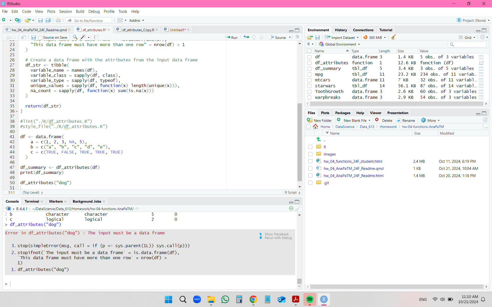
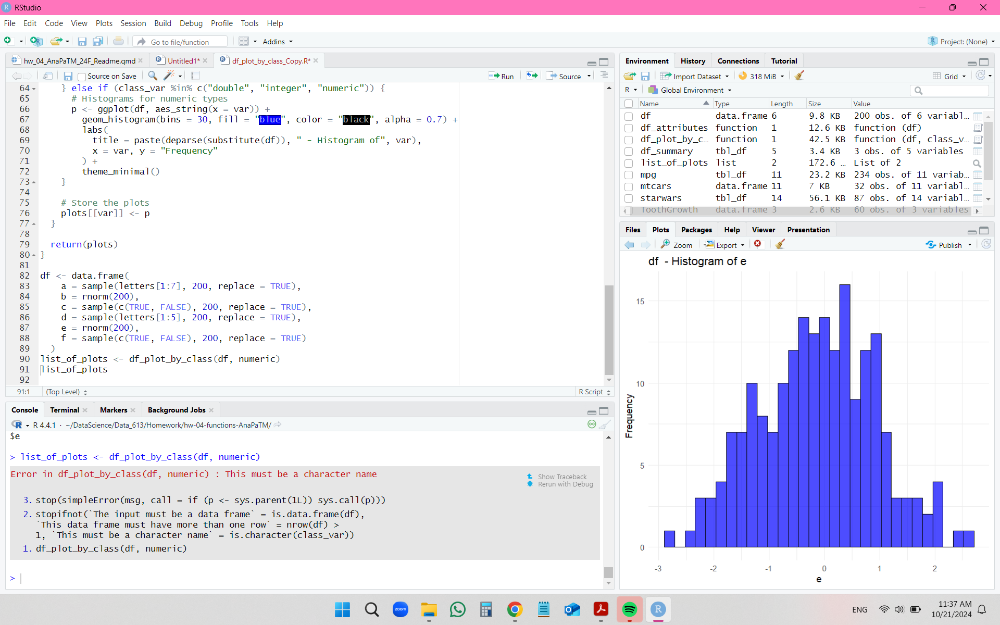
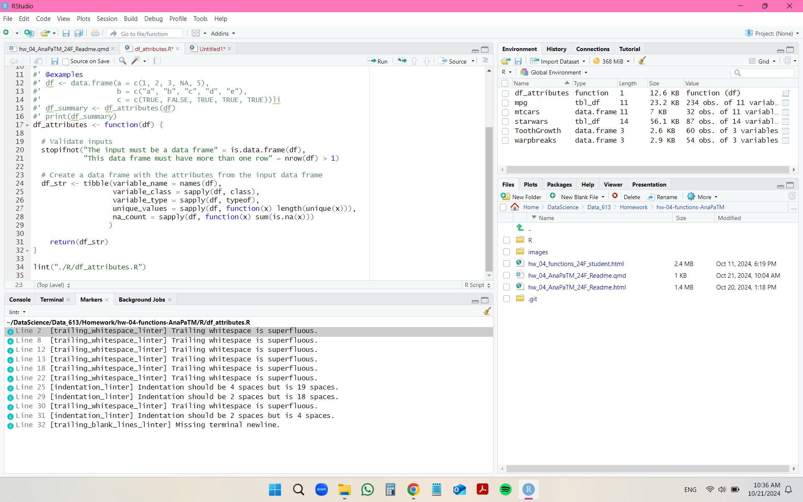
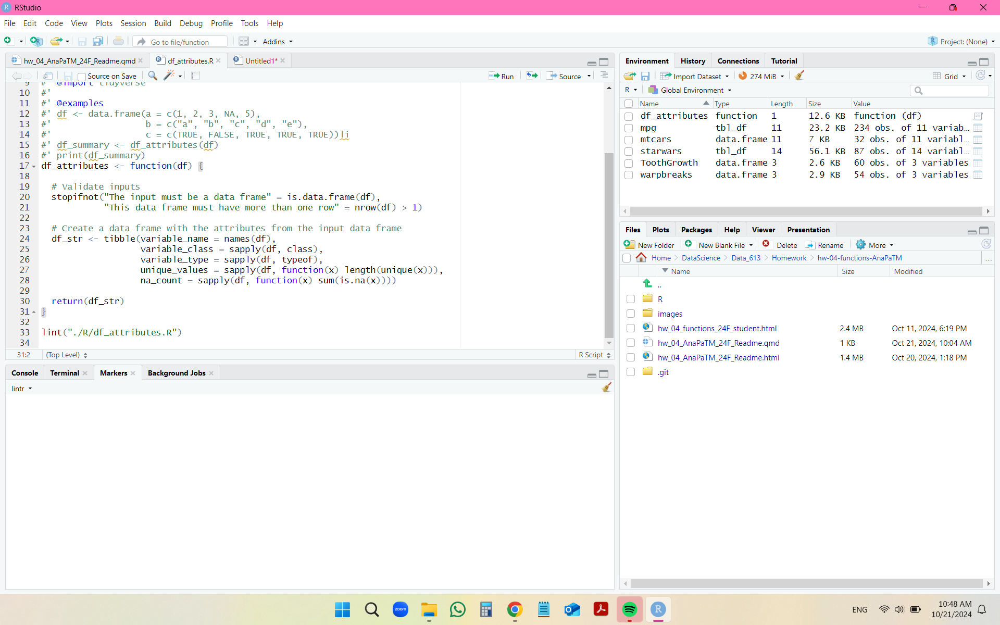
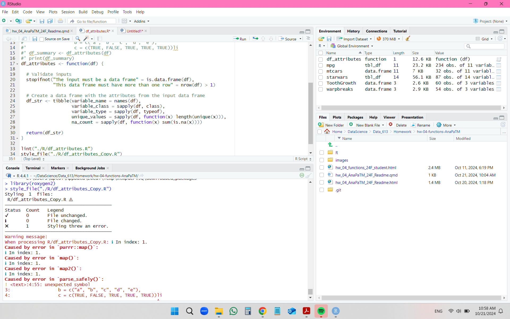
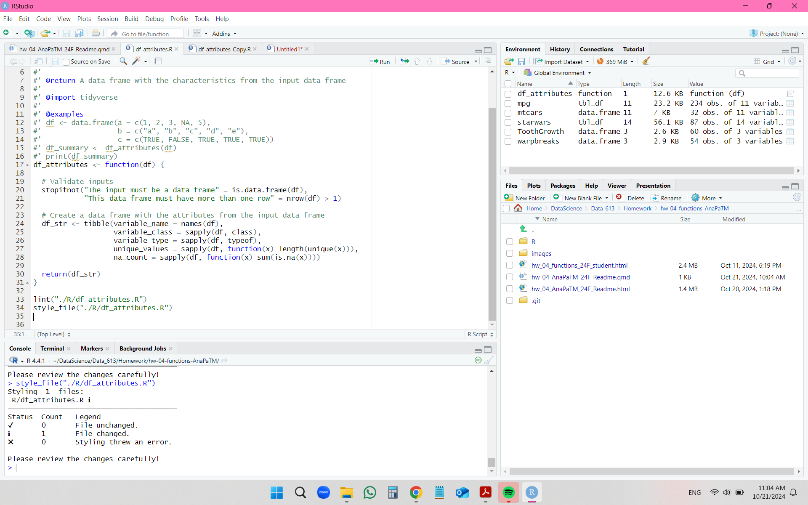
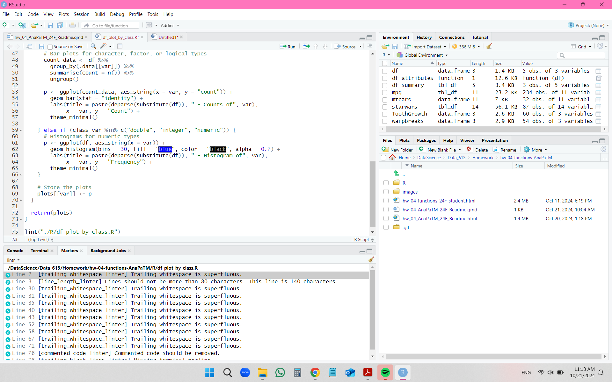
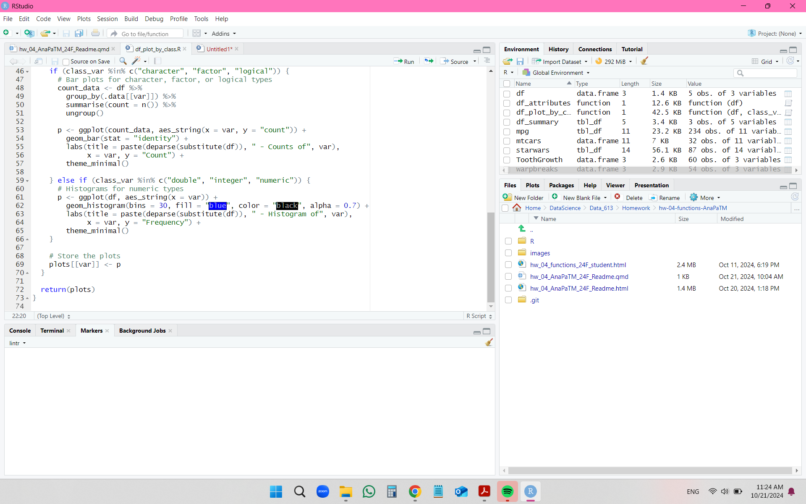
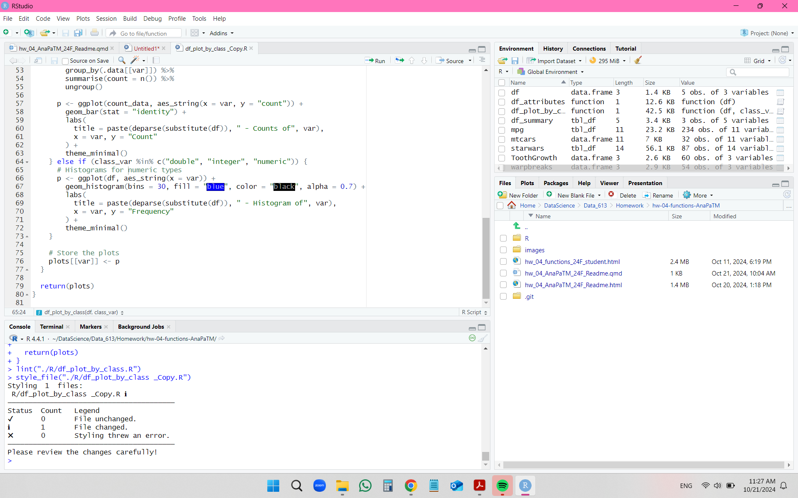

## Description

This repository contains two functions: **"df_attributes.R"** and **"df_plot_by_class.R"**. These functions can be used for analyzing and investigating any given R data frame.

The function **"df_attributes.R"** can be used to extract the characteristics of a data frame. It creates and outputs a new data frame containing the following information extracted from the original input data frame: the variable name(s), variable class(es), variable type(s), number of unique values and number of missing values, for all columns in a data frame.

The function **"df_plot_by_class.R"** may be used to create a set of plots for a specific variable class and for all variables in the data frame with that variable class. It takes as inputs a data frame and the name of the variable class of interest such as character, numeric, double, integer, factor and logical.

The examples below show how to source and use the functions in your code as part of a workflow.

## Examples

To demonstrate the functions, I will use the following R system data frames: **mpg, mtcars and starwars**, as the functions depend on the {tidyverse} R package.

```{r}

suppressMessages(library(tidyverse))

data(mpg)
glimpse(mpg)

data(mtcars)
glimpse(mtcars)

data(starwars)
glimpse(starwars)

```


## Example: Using function "df_attributes.R"

```{r}
# Source the function
source ("./R/df_attributes.R")

# Print out the function
df_attributes

# Call the function
df_attributes(mpg)
df_attributes(mtcars)
df_attributes(starwars)

```


## Example: Using function "df_plot_by_class.R"

```{r}

# Source the function
source ("./R/df_plot_by_class.R")

# Print out the function
df_plot_by_class

# Call the function
df_plot_by_class(mpg, "numeric")
df_plot_by_class(mpg, "character")
df_plot_by_class(mtcars, "numeric")
df_plot_by_class(starwars, "integer")

```


## Debugging

Considering the following tools: RStudio "traceback", Lintr and Styler.


### Function: df_attributes.R

Using RStudio "traceback" link to access the function error prompt. See images below.



### Function: df_plot_by_class.R

Using RStudio "traceback" link to access the function error prompt. See image below.



### Using Lintr and Styler to comply with {tidyverse} style formats

Both {lintr} and {styler} were used on the functions above to make sure the coding was in comply with the {tidyverse} style recommendation format. Firstly, {lintr} suggested some few editing to the code and after the changes, the code was in comply {lintr}. Following, I ran the {styler} code and Styler still found necessary to automatically changed the code and saved the changes. I would recommend just using Lintr for the future since Styler have a more global set of requirements for coding other than just for R. Both functions in this repo are in perfect agreement with the tidyverse style guide.

See images below for {lintr} and {styler} suggestions and fixes:

df_attributes

#### Function: df_attributes.R

##### Lintr - Suggestions



##### Lintr - Cleared



##### Styler - Suggestions



##### Styler - Cleared




#### Function: df_plot_by_class.R


##### Lintr - Suggestions



##### Lintr - Clear



##### Styler



