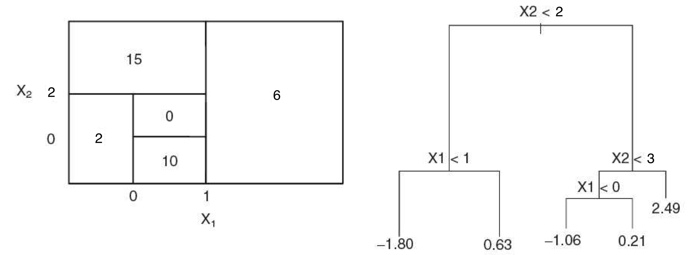
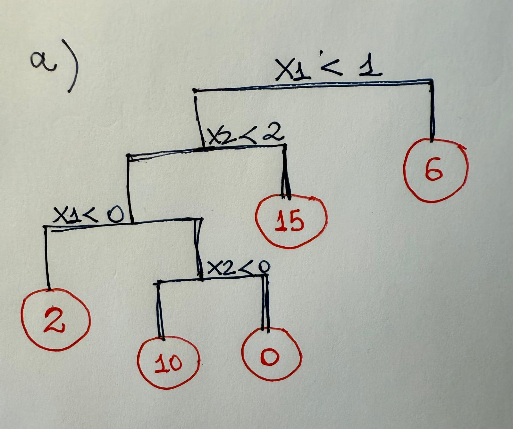
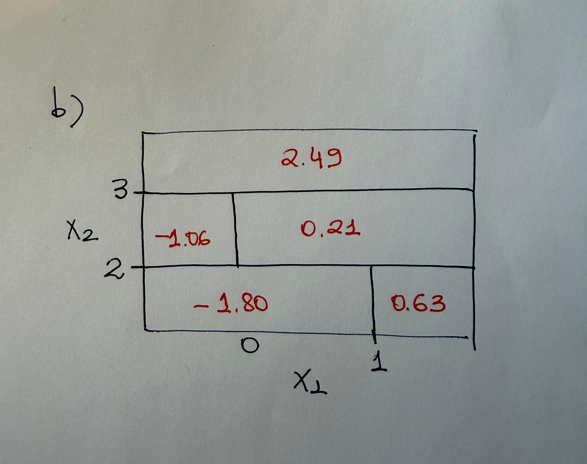

<style>
.my-textbox {
  background-color: #f5ebeb;
  border: 1px solid #ccc;
  padding: 15px;
  border-radius: 5px;
  margin-bottom: 20px;
}
</style>
<br>


# Trees

Look at the figure below.

{#fig-tree fig-align="center"}

(a) Draw a tree diagram corresponding to the partition of the predictor space shown for Tree A (left-hand panel of @fig-tree). The numbers inside the boxes indicate the mean of Y within each region. Upload it here: 




(b) Draw a partition of the predictor space for the tree diagram for Tree B (right-hand panel of @fig-tree) and indicate the mean of Y for each region.



(c) Are these regression trees or classification trees? Why?

<br>
<div class="my-textbox">

Both images represent **regression trees**, used to predict a continuous response variable.

The numbers in the terminal nodes (like 15, 6, 2, 0, 10, or −1.80, 0.63, 2.49, etc.) are continuous values, not discrete class labels. Regression trees predict a numerical value, while classification trees predict a category such as “Yes/No” or “A/B/C”.

</div> 
<br>


# Bagging

Suppose we produce ten bootstrapped samples from a data set containing equal numbers of two classes red and green so $P(\text{Class is Red}) = .5 = P(\text{Class is Green})$.

We then apply a classification tree to each bootstrapped sample and, for a specific value of `X`, produce 10 estimates of $P(\text{Class is Red} |X)$: 0.25, 0.25, 0.35, 0.45, 0.45, 0.55, 0.65, 0.65, 0.70, and 0.75.

There are two common ways to combine these results together into a single class prediction.

-   One is the majority vote approach where we compare each value to a threshold and see how many are greater than the threshold.
-   The second approach is to classify based on the average probability across each estimate and then compare to the threshold.

In this example, what is the final classification for each approach?


<br>
<div class="my-textbox">

* Let's assume the classification threshold is 0.5:
  
  * Predict Red if P(Red/X) > 0.5

  * Predict Green if P(Red/X) <= 0.5
  
* Based on the majority vote approach: We would **predict a tie for each class with no defined mijority**, since.

    * Number of Reds: 5

    * Number of Greens: 5
    
* Based on the average probability approach: 

Based on the 10 estimated probabilities of Red, $P(\text{Class is Red} |X)$: 0.25, 0.25, 0.35, 0.45, 0.45, 0.55, 0.65, 0.65, 0.70, and 0.75, we can compute the mean of the 10 probabilities:

$$mean = \frac{0.25 + 0.25 + 0.35 + 0.45 + 0.45 + 0.55 + 0.65 + 0.65 + 0.70 + 0.75}{10} = \frac{5.05}{10} = 0.505$$
Comparing with the threshold, 0.505 is larger than 0.5, therefore, we would **predict Red**.

</div> 
<br>


# Orange Juice Purchases (Chap. 8, \# 9)

This problem involves the OJ (orange juice) data set which is part of the {ISLR2} package. To find its description, type `?OJ`.

```{R}
#| message: false
#| echo: fenced
library(tidyverse)
library(ISLR2)
# ?OJ
glimpse(OJ)

table(OJ$Purchase)
```

(a) Create a validation set with the training set containing a random sample of 600 observations and a test set containing the remaining observations. Use `set.seed(1234)`.


```{R}
set.seed(1234)
n <- nrow(OJ)
Z <- sample(1:n, 600)
train <- OJ[Z,]
test <- OJ[-Z,]
```


(b) Use the {tree} package with the training data to fit a tree to the training data to predict `Purchase` based on the other variables as predictors.

-   Use the `summary()` and describe the results obtained.
-   Which variables are used in the tree?
-   What is the training error rate?
-   Do the variables make sense to you?


```{R}
library(tree)
tr <- tree(Purchase ~ ., data = train)
summary(tr)
```

This builds a classification tree predicting whether a customer will purchase **CH (Citrus Hill) or MM (Minute Maid)** orange juice based on several predictors such as prices, loyalty, and demographics.

According to:
Variables actually used in tree construction:
[1] "LoyalCH"       "PriceDiff"     "ListPriceDiff" "SalePriceCH"  

The tree used four predictors:

LoyalCH – a measure of brand loyalty to Citrus Hill (the most important variable).

PriceDiff – the difference between the price of MM and CH.

ListPriceDiff – difference in list prices between the two brands.

SalePriceCH – sale price of Citrus Hill.

These variables were chosen because they best split the data to separate the two classes (CH vs. MM).

Training error rate: Misclassification error rate: 0.1567 = 94 / 600

That means:

Out of 600 training observations, 94 were misclassified.

So the training accuracy is: 1 - 0.1567 = 0.8433 (or 84.33%).

Training error rate: 15.67%

Do the variables make sense?

Yes, they make intuitive sense in the context of orange juice purchasing behavior:

LoyalCH: Measures brand loyalty—likely the strongest predictor of repeat purchases. Customers who previously bought CH are more likely to buy CH again.

PriceDiff: Price is a natural factor influencing which brand a consumer buys.

ListPriceDiff and SalePriceCH: Reflect price sensitivity and promotional effects; lower sale prices or favorable list prices make CH more attractive.

So, the variables used are all economically and behaviorally meaningful.


* Summary of Results

Metric	Description	  Result

Model type:	Classification tree predicting Purchase ==>	tree() model

Variables used:	LoyalCH, PriceDiff, ListPriceDiff, SalePriceCH ==>	4 predictors

Terminal nodes:	Complexity of the tree ==>	8

Residual mean deviance:	Measure of fit ==>	0.7085

Training misclassification rate:	94 / 600 = 15.67%	==> Accuracy ≈ 84.3%

Interpretation of variables:	All variables are logical predictors of purchase choice ==>	Yes


<br>
<div class="my-textbox">

* The tree used four predictors: "LoyalCH", "PriceDiff", "ListPriceDiff" and "SalePriceCH".

* The tree has 8 terminal nodes.

* Training error rate: Misclassification error rate: 0.1567 = 94 / 600, meaning that tut of 600 training observations, 94 were misclassified. So the training accuracy is: 1 - 0.1567 = 0.8433, or 84.33%.

* Yes, the variables make intuitive sense in the context of orange juice purchasing behavior:

    * LoyalCH: Measures brand loyalty—likely the strongest predictor of repeat purchases. Customers who previously bought CH are more likely to buy CH again.

    * PriceDiff: Price is a natural factor influencing which brand a consumer buys.

    * ListPriceDiff and SalePriceCH: Reflect price sensitivity and promotional effects; lower sale prices or favorable list prices make CH more attractive.

</div> 
<br>


(c) Type in the name of your tree object to get a detailed text output.

-   How many decisions were made to select the observations for Node 26 and at what nodes.
-   Describe each of the outputs in the line for node 26.

```{R}
tr
```

<br>
<div class="my-textbox">

Four decisions were made before node 26 at nodes 1, 3, 6 ad 13. At node 26 the decision is for ListPriceDiff < 0.255, with 74 observations out of which 64.8% was for CH and 35.2% for MM. Therefore, the prediction was for `CH` since it had the higher probability of happening. Those are the Y probabilities, which are the proportions for each class based on the total observations considered in the node. The asterisk, *, indicate a terminal node.

</div> 
<br>


(d) Create a plot of the tree, and identify node 26.

```{R}
plot(tr)
text(tr)
```

<br>
<div class="my-textbox">

Node 26 is on the right side of the root node and on the left side of node 6 (LoyalCH < 0.753545). It's the last node to split at ListPriceDiff < 0.255 going left and predicting `CH`.

</div> 
<br>


(e) Predict the response on the test data, and produce a confusion matrix comparing the test labels to the predicted test labels. What is the test error rate?

```{R}
yhat = predict(tr, newdata = test, type = "class")
table(yhat, test$Purchase)
```
```{R}
mean(yhat != test$Purchase )
```
<br>
<div class="my-textbox">

The test prediction error rate is 0.187234 or about 18.72%.

</div> 
<br>


(f) Use `cv.tree()` on the training set to determine the optimal tree size based on the misclassification rate. Use `set.seed(1234)`.

```{R}
set.seed(1234)
cv <- cv.tree(tr, FUN = prune.misclass)
cv
```

<br>
<div class="my-textbox">

For determining the optimal tree size, I select the tree size that minimizes the misclassification rate (`dev`). The smallest deviance is 101, which occurs for both tree sizes 8 and 4.

Therefore, the optimal tree size is 4 terminal nodes, since it's better to choose the smaller tree among those with the same deviance. 

</div> 
<br>


(g) Produce a plot with tree size on the x-axis and cross-validated classification error rate on the y-axis.

```{R}
plot(cv)
```


(h) Which tree size corresponds to the lowest cross-validated classification error rate with fewest nodes?

<br>
<div class="my-textbox">

As observed above, the optimal tree size (based on cross-validated misclassification rate) is 4 terminal nodes, and the result is the same for 5, 6, 7 and 8 terminal nodes.

</div> 
<br>


(i) Produce a pruned tree corresponding to the optimal tree size obtained using cross-validation. If cross-validation does not lead to selection of a pruned tree, then create a pruned tree with five terminal nodes.

-   What variables remain?


```{R}
trp <- prune.misclass(tr, best = 4)
summary(trp)
```


<br>
<div class="my-textbox">

For a tree size with 4 terminal nodes, only two variables were selected: `LoyalCH` and `PriceDiff`.

</div> 
<br>


(j) Compare the training error rates between the pruned and unpruned trees. Which is higher?

```{R}
summary(tr)$misclass[1]/summary(tr)$misclass[2]
summary(trp)$misclass[1]/summary(trp)$misclass[2]
```
<br>
<div class="my-textbox">

The training errors are exactly the same for the pruned or unpruned trees.

</div> 
<br>

(k) Compare the test error rates between the pruned and unpruned trees. Which would you recommend as the final tree?


```{R}
yhat = predict(tr, newdata = test, type = "class")
mean(yhat != test$Purchase )
```


```{R}
yhatp = predict(trp, newdata = test, type = "class")
mean(yhatp != test$Purchase )
```
<br>
<div class="my-textbox">

The test error rates are exactly the same for both trees: 0.1872. I would recommend the simplest tree with just 4 nodes since it provides the same results and it's a simpler and more interpretable model.

</div> 
<br>
