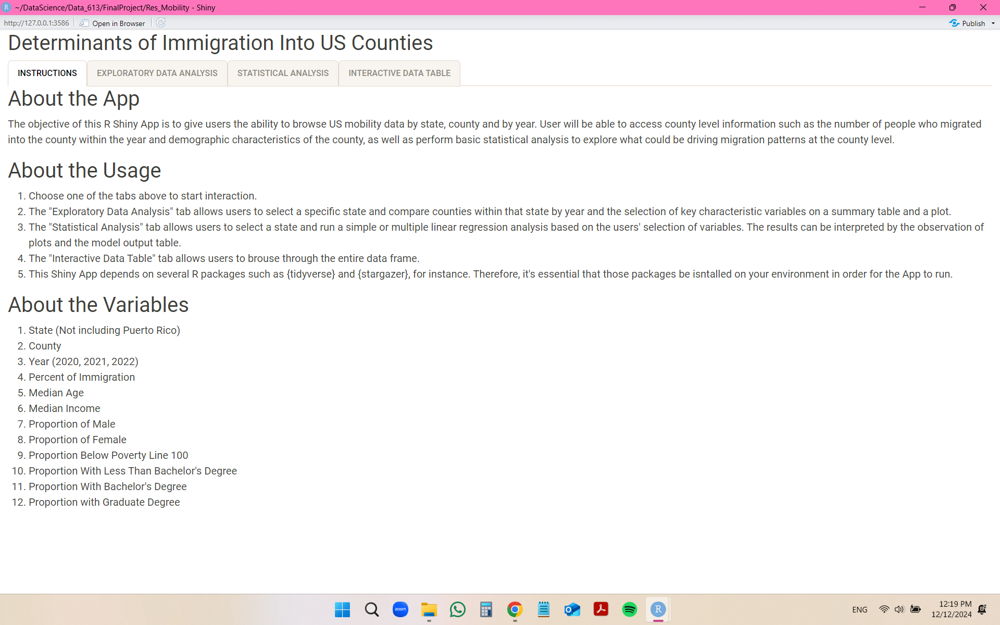
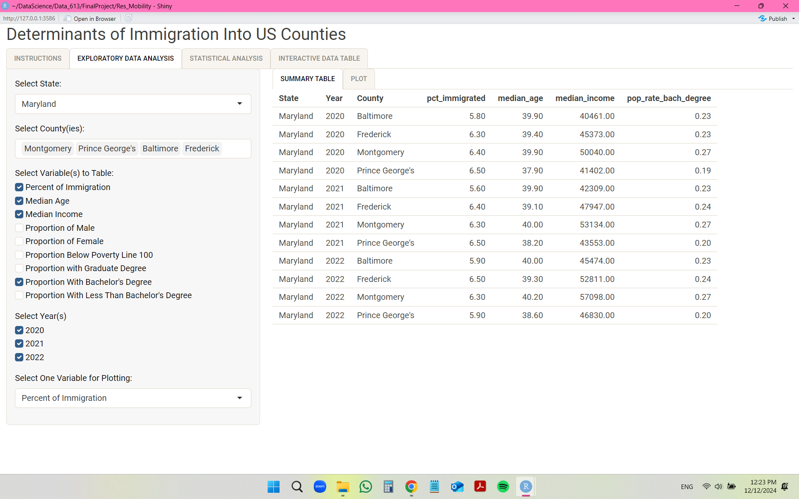
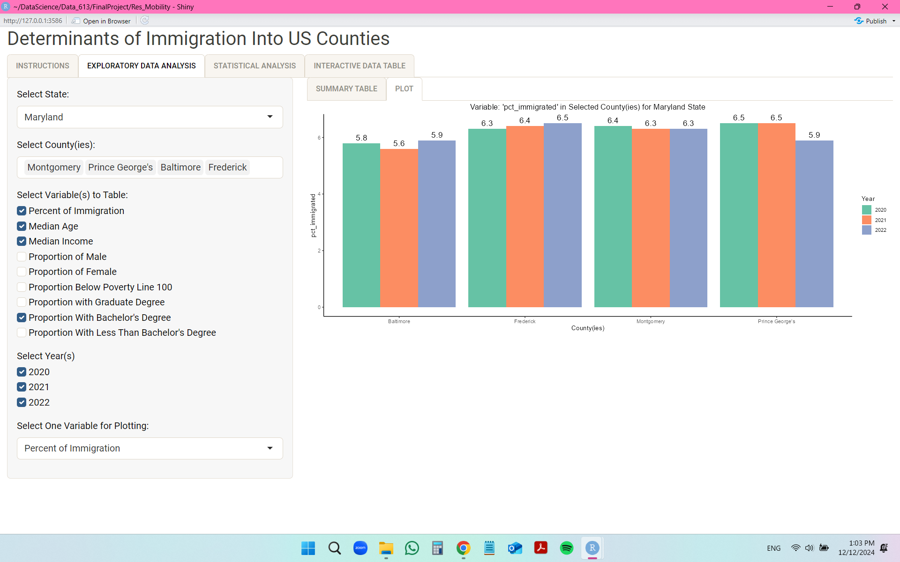
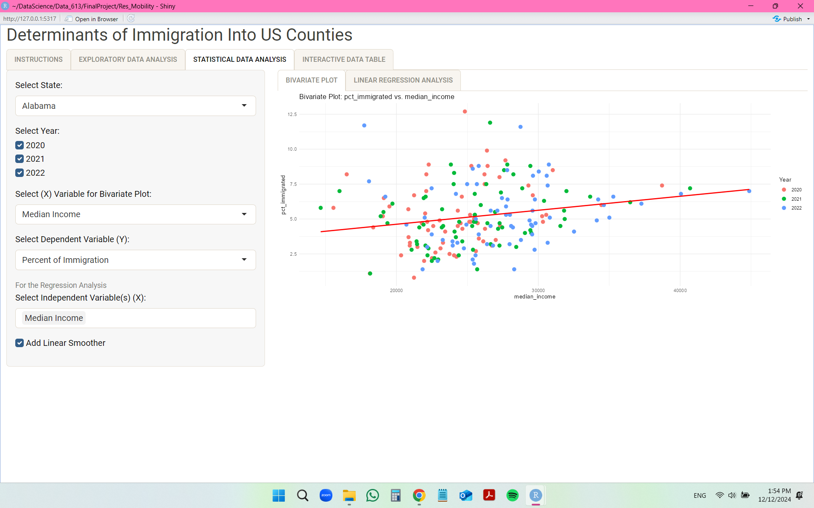
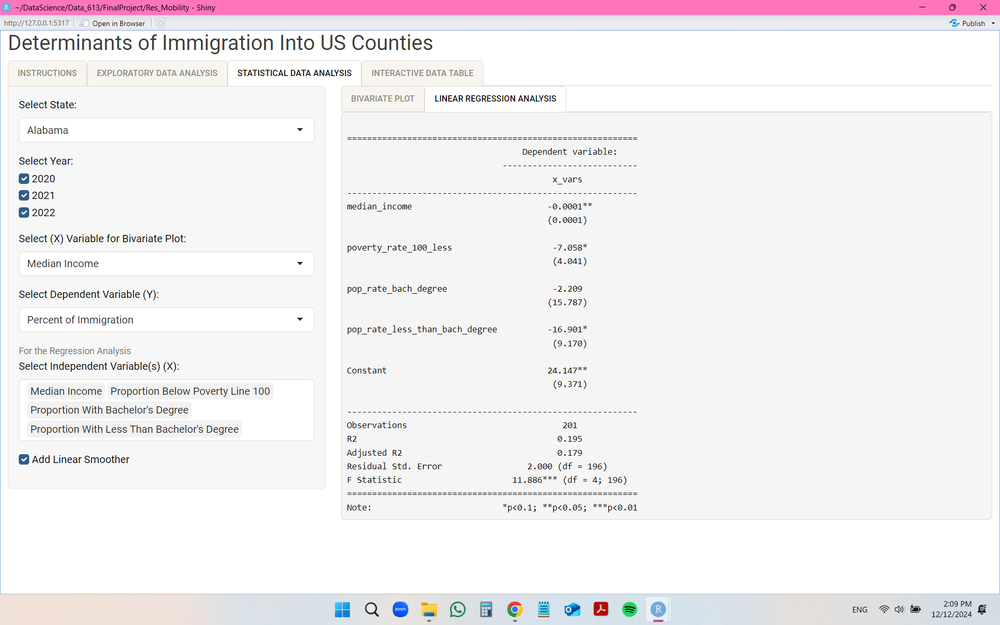
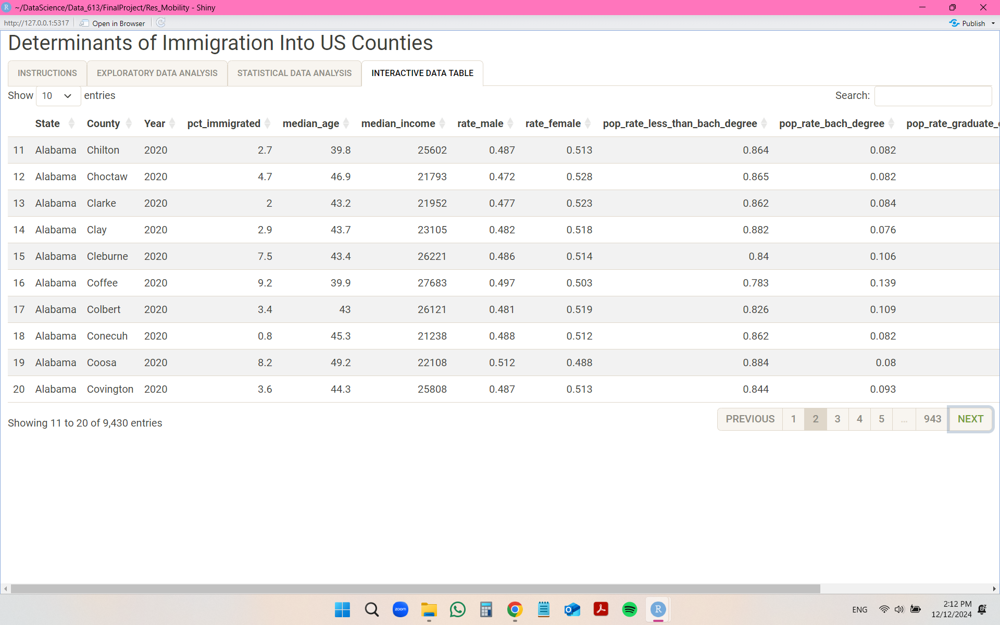

## Use Case

The objective of this Shiny App is to give users the ability to browse US mobility data by county and by year. Users will be able to access county level information such as the proportion of the population that migrated into the county within the year and demographic and socioeconomic characteristics of the county, as well as perform basic statistical analysis to explore what could be driving migration patterns at the county level. Migration at the county level includes migration from other counties in the same state, other states, and other countries.

My Shiny App can be used to access the number of migrants into any specific U.S. county for the years of 2020, 2021 and 2022.

The App can be used for:

- Run exploratory data analysis. 
- Run statistical data analysis, such as linear regression analysis.
- Access visual aids and trends on the data.
- Observe and interact with the database.

The easy interaction provided by the App makes exploring the data a simple task, without the need to download the data and write code since the App will use simple selection menus.

## Required Packages

Note that the App utilizes the following set of libraries in order to run and such packages must be installed on your environment prior to running the App.

- library(shiny) - Used to build the Shine App web application.

- library(tidyverse) - Uploads a group of packages for data manipulation and visualization.

- library(ggthemes) - Provides various theme options for graphical visualization.

- library(bslib) - Provides custom themes for the Shiny App visualization.

- library(DT) - Allows the uploading of the interactive data frame onto the Shiny App.

- library(stargazer) - Used for tidying up output tables for a better visualization of tables.

## Data Source

The data source for this analysis is the **'American Community Survey 1-year Estimates'** for the years of 2020, 2021 and 2022.

* *Census Bureau* metadata extractor: <https://data.census.gov/table>

For each data file for each year, the number of observation is **3,142** and the number of variables is **562**. Therefore, I'll be manipulating three data files considered for the study: 2020, 2021 and 2022.

## Workflow

There are four tabs available for interaction: 

1) INSTRUCTIONS: This tab provides basic information about the Shiny App and the database used for this research.

- This is the visualization of the **App**:
\n

2) EXPLORATORY DATA ANALYSIS: When clicking on this tab, users will build a **summary table** and **plot** for visualization.\

Users will be asked to choose a state. Thus, the counties within that state will automatically become available for selections and users can select as many counties as they wish for comparison. The next selection will be of the key characteristic variables, which is available with a point and click option. It’s possible to select as many variables as desired. Next, users can click on the years they wish to include in the report. For the plot, users will select one single variable for the (Y) axis and can compare counties by the (X) variable across the years.

- This is the visualization of the **summary table**:
\n

- This is the visualization of the **plot**:
\n

3) STATISTICAL DATA ANALYSIS: When clicking on this tab, users will build a **bivariate plot** and a **linear regression analysis** output.\

Users will be asked to choose a state and click on the years to include in the analysis. Next, users will choose a variable for the (X) axis and another variable for the (Y) axis (dependent variable) of the bivariate plot. Users can also choose multiple independent variables for the linear regression analysis.

- This is the visualization of the **bivariate plot**:
\n

- This is the visualization of the **linear regression analysis** table:
\n

4) INTERACTIVE DATA ANALISYS: When clicking on this tab, users will be able to navigate through the database considered for the App\

- This is the visualization of the **interactive data table**:
\n

## References

Kerns-D’Amore, at al. "Migration in the United States: 2006 to 2019, American Community Survey Reports". ACS-53, July 2023, <https://www.census.gov/content/dam/Census/library/publications/2023/acs/acs-53.pdf>
\n

Kuhnt, Jana. "Drivers of Migration. Why Do People Leave Their Homes? Is There an Easy Answer? A Structured Overview of Migratory Determinants". German Development Institute, 02/2019, <https://www.idos-research.de/uploads/media/DP_9.2019.pdf>
\n

Batalova, Jeanne. "The Frequently Requested Statistics on Immigrants and Immigration in the United States". MARCH 13, 2024,  <https://www.migrationpolicy.org/sites/default/files/publications/FRS-PRINT-2024-FINAL.pdf>
\n

United States Census Bureau: <https://data.census.gov/table>
